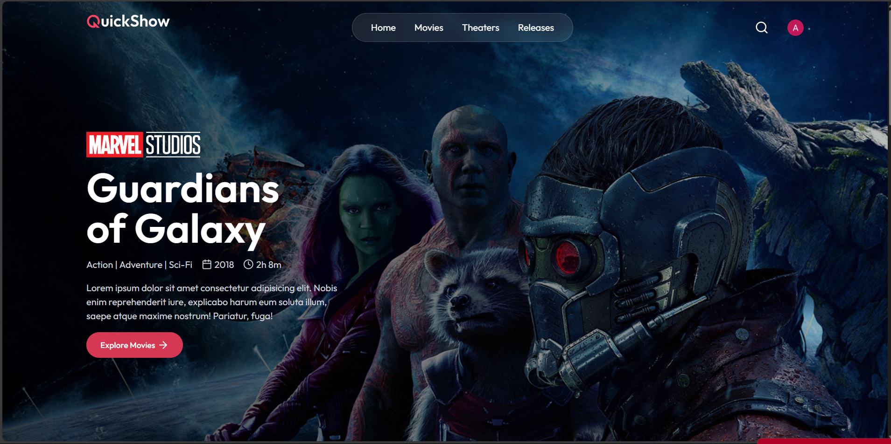
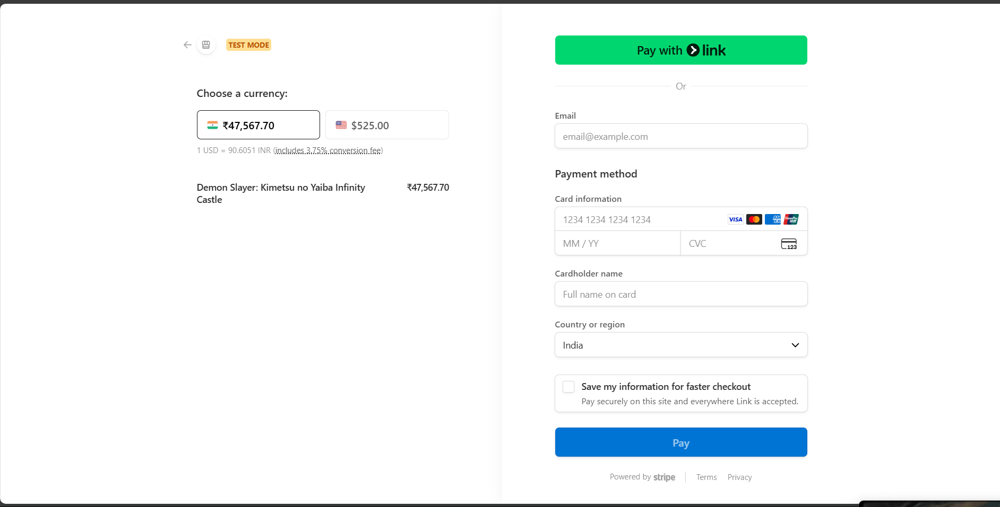
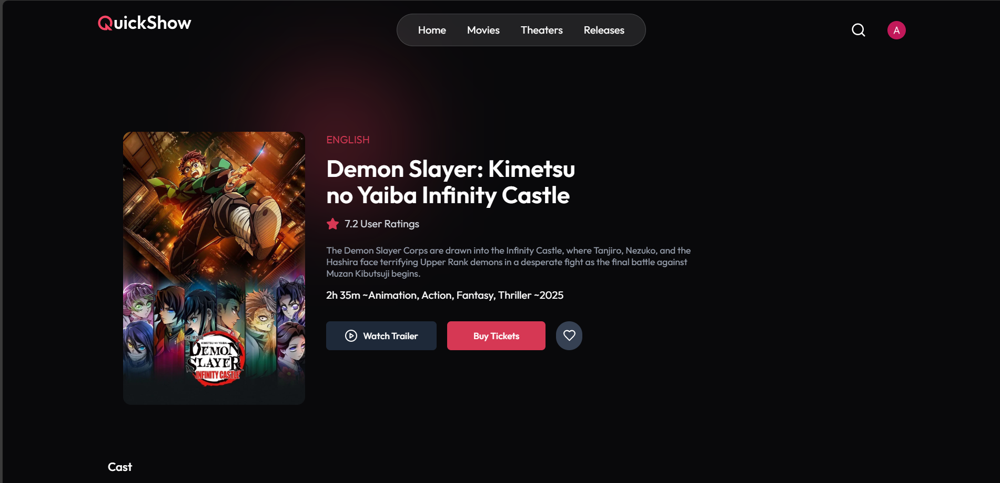
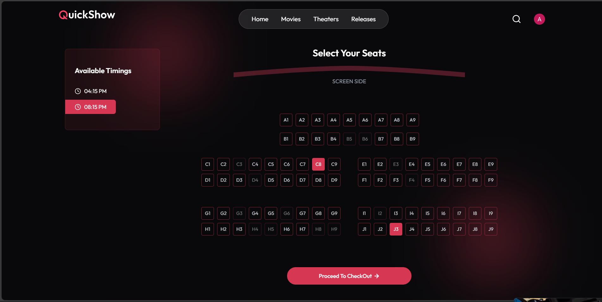
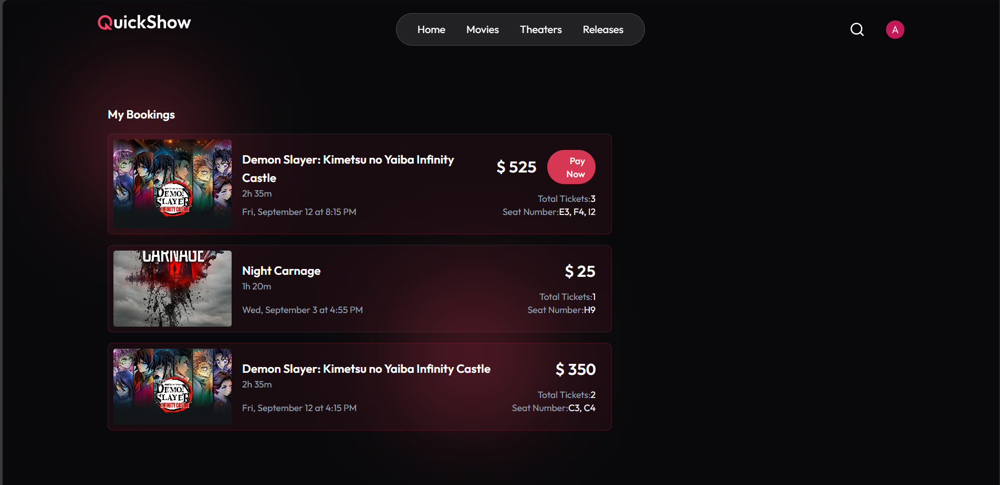

# ​​ QuickShow – Online Ticket Booking Platform

QuickShow is a **full-stack online ticket booking application**, enabling users to securely reserve and pay for show tickets, with automated confirmation and reminder emails.  
Experience it live: [QuickShow Demo](https://quick-show-rho-six.vercel.app/)

---

##  Features

- 🔐 **Authentication & User Management** – Secure login/signup powered by Clerk.
- 🎭 **Browse & Book Shows** – Users can view available shows and reserve seats in real-time.
- ⏳ **10-Minute Seat Reservation**  
  - Seats are held for **10 minutes** during checkout.  
  - If payment is completed on time → Booking confirmed.  
  - Otherwise → Seats are automatically released for others.
- 💳 **Secure Payments via Stripe**
- 📧 **Email Notifications** – 📨 Brevo (SMTP) + Nodemailer integration:
  - **Booking confirmation** sent instantly.
  - **Reminder email** delivered **8 hours before** showtime.
- ⚡ **Event-Driven Workflow Management** – Inngest handles background tasks like releasing seats and scheduling reminders.
- 🗄️ **MongoDB** for data storage of shows, users, bookings, and more.
- ⚙️ **For Admin Access** for Admin access contact me.

---

##  Tech Stack

| Frontend           | Backend                   | Database    | Auth     | Payments | Emails               | Workflow Automation |
|-------------------|---------------------------|-------------|----------|----------|----------------------|----------------------|
| React.js + Tailwind CSS | Node.js + Express         | MongoDB     | Clerk    | Stripe   | Brevo (SMTP) + Nodemailer | Inngest              |

---

##  Live Deployment

Check out the app in action: [QuickShow Live Demo](https://quick-show-rho-six.vercel.app/)

---

##  Installation & Local Setup

1. **Clone the repository**

   ```bash
   git clone https://github.com/AshimChoudhary/QuickShow.git
   cd QuickShow

2. **Install Dependencies**
   
   # Server dependencies
        cd server
        npm install
        npm run server

  # Client dependencies
      cd ../client
      npm install
      npm run dev

##  Configure environment variables

 **Server .env**
 
    MONGODB_URI 
    CLERK_PUBLISHABLE_KEY
    CLERK_SECRET_KEY
    INNGEST_EVENT_KEY
    INNGEST_SIGNING_KEY 
    TMDB_API_KEY
    STRIPE_PUBLISHABLE_KEY
    STRIPE_SECRET_KEY
    STRIPE_WEBHOOK_SECRET
    SENDER_EMAIL
    SMTP_USER
    SMTP_PASSWORD

 **Client .env**

    VITE_CURRENCY = '$'
    VITE_CLERK_PUBLISHABLE_KEY
    VITE_BASE_URL = http://localhost:3000
    VITE_TMDB_IMAGE_BASE_URL = https://image.tmdb.org/t/p/original

##  ScreenShots

**Home Page**


**CheckOut Page**


**Movie Info Page**


**Seat Layout Page**


**My Bookings Page**



## 👨‍💻 Author

**Ashim Choudhary**  

- GitHub: [github.com/AshimChoudhary](https://github.com/AshimChoudhary)  
- LinkedIn: [linkedin.com/in/ashim-choudhary-707191336](https://www.linkedin.com/in/ashim-choudhary-707191336/)  


